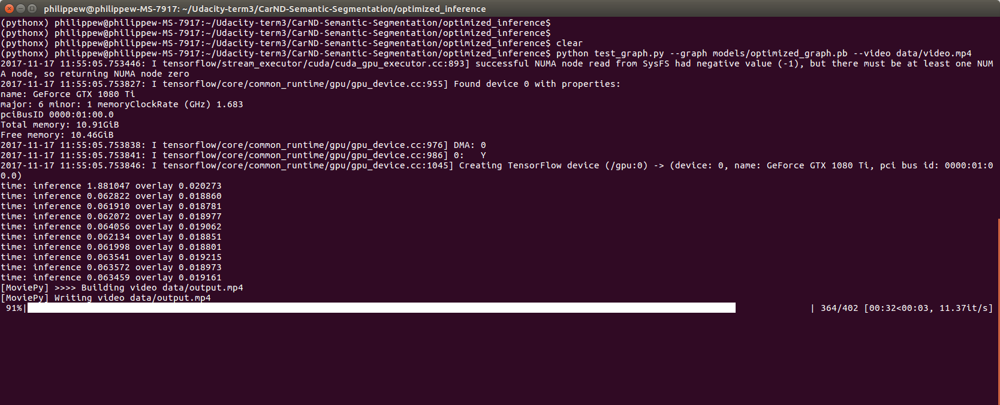
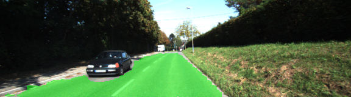
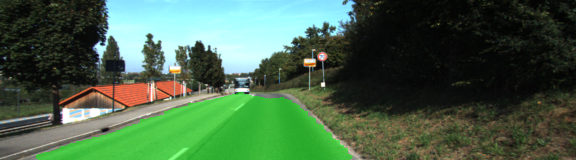
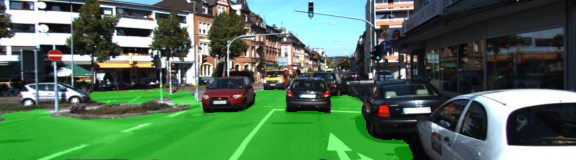
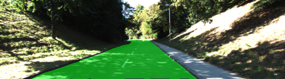
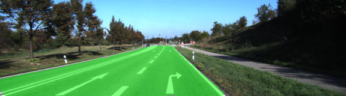
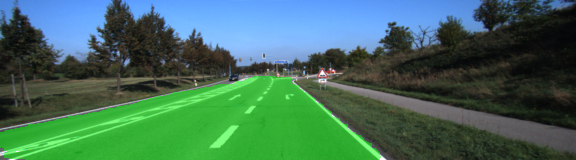
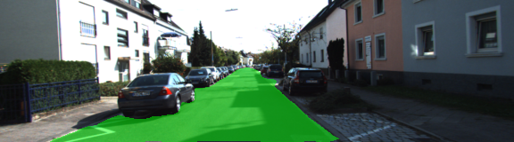
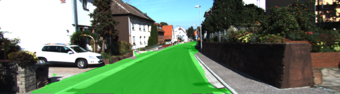
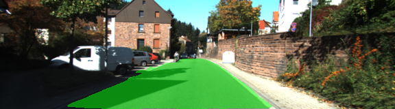

# Semantic Segmentation

[//]: # (Image References)
[image1]: ./img/output.gif
[image2]: ./img/vgg16.png
[image3]: ./img/mobilenet_v1.png
[image3]: ./img/video_11fps.png
[image4]: ./img/um_000019.png
[image4]: ./img/um_000031.png
[image4]: ./img/umm_000090.png
[image4]: ./img/umm_000091.png
[image4]: ./img/uu_000023.png
[image4]: ./img/uu_000046.png

<p align="center">
     
     <br>semantic segmentation with a FCN network 
</p>
  
The network used for above video demo, fcn8s-phw.pb, was trained on cityscapes dataset with Tensorflow.  
It can be downloaded from here: https://drive.google.com/open?id=1Pfb0BSL8Y0TSghMOqjUKfQ4ZpAeFsTmz    

### Project description

Pixel-wise classification is implemented via a Fully Convolutional Network (FCN) making use of a VGG16 encoder pre-trained on Imagenet for optimal performances.  
  
Two databases are used for training:   
- Kitti: http://www.cvlibs.net/datasets/kitti/eval_road.php   
- Cityscapes: https://www.cityscapes-dataset.com    

The FCN8s network is trained to perform pixel-wise classification among 20 classes as per official cityscapes benchmark.  

The implementation is tested against the official cityscapes test set in terms of IOU metric.  
Optimizations on the inference part are being done thanks to the use of Tensorflow freeze, optimize and transform_graph tools.  
cf https://github.com/tensorflow/tensorflow/blob/master/tensorflow/tools/graph_transforms/README.md  
A demonstration video is provided: based on cityscapes video sequences for qualitative evaluation.

The current status in terms of performance is the following:  
* Cityscapes test set IOU: 73.05% with (256, 512) input images.   
So with a subsampling of 4 compared to raw images and **ground truth** images provided by Cityscapes.   
* inference time on a GTX 1080 TI: 63 ms per image with 32 bits weights  

### How to train and test on Kitti and Cityscapes test sets

Training and testing on Kitti for binary pixel-wise classification (road / not road):  

```
python main.py
```
The results on the Kitti test set are stored in runs subdirectory.  
  
Training and testing on Cityscapes for 20 classes pixel-wise classification:  
```
python main_cityscapes.py --epoch 100 --lr 5e-4 --batch-size 4 --early-stop True --patience 3
```  

The results on the Cityscapes test set are stored in city_runs subdirectory.    
Moreover, the mean IOU metric as per official Cityscape benchmark (with a subsampling of 4 in our case) is provided.    

### How to optimize for inference

In optimized_inference subdirectory:  
cf optimized_inference/doc/howto.txt  
The result is a protobuf file optimized for inference: stored in optimized_inference/models/optimized_graph.pb    
That will be used later on to perform video decoding.    

### How to measure inference time and test on video  

In optimized_inference subdirectory:   
```
python test_graph.py --graph models/transformed_graph.pb --video data/video.mp4
```

The result is stored as: optimized_inference/data/output.mp4    
  
  
  <p align="center">
     
     <br>semantic segmentation at 11 fps
</p>

Doing 8 bits quantization results in a graph that is 4 times smaller: 130 MB instead of 520 MB.  
In theory, it should be faster, but in practice today with Tensorflow is it twice slower.  
cf: https://github.com/tensorflow/tensorflow/blob/master/tensorflow/tools/graph_transforms/README.md  

With TensorRT tool from Nvidia it is expected to get close to a 3x speed improvement on a drive PX2 board.  
cf http://on-demand.gputechconf.com/gtc/2017/presentation/s7310-8-bit-inference-with-tensorrt.pdf  

### Network architecture  

A VGG16 encoder pre-trained on Imagenet is being used with the following modifications:
- the input image is systematically downscaled to (256, 512). So by a factor of 4 compared to Cityscapes raw images in order to reduce computation time 
- the fully connected layers are replaced by 1x1 convolutions

 <p align="center">
     
     <br>vgg16
</p>

On top of VGG16, we add 1x1 convolutions to reduce the number of filters from 4096 to whatever the number of classes for our model is.  
  
Then a decoder is in charge of upsampling back to the original image size (i.e. (256, 512) in our case) via 3 consecutive conv2d_transpose operations (x2 x2 x8 => x32 in total; as the input image was downscaled in the encoder by a factor of 32).  
Skip layers are being used to retain and propagate information that was present in the encoder before fully downsampling the image and that would otherwise be lost: this increases the accuracy of the semantic segmenter. 

Concerning the VGG16 encoder:  
It was designed in 2014 by Visual Geometry Group at Oxford University and achieved best results at Imagenet classification competition. VGG has a simple and elegant architecture which makes it great for transfer learning: the VGG architecture is just a long sequence of 3x3 convolutions broken up by 2x2 pooling layers and finished by 3 fully connected layers at the end. Lots of engineers use VGG as a starting point for working on other images deep learning tasks and it works really well. The flexibility of VGG is one of its great strength. Nevertheless, it is quite old now and pretty big.  
This very big front end could be replaced by other alternatives like GoogleNet or MobileNet, also pre-trained on Imagenet, if we want to increase fps. The trade-off in terms of complexity vs accuracy is depicted below. MobileNet is especially recommended for embedded devices applications.

 <p align="center">
     
     <br>MobileNet
</p>

Note that there exists also netwrok architectures like ENet and ERFNet targetting specifically low power embedded devices and enabling real-time semantic segmentation as well. Based on Cityscapes benchmark results, ERFNet looks very interesting: https://www.cityscapes-dataset.com/benchmarks/#pixel-level-results .  

### Hyperparameters tuning on Cityscapes

The following hyperparameters were tuned one by one and tested on 6 epochs on Cityscapes training before being used for full training over 50 epochs:
- learning rate: 5e-4
- batch size: 4
- L2 regularization: none
- init of convolutional layers in the decoder part: tf.truncated_normal_initializer(stddev = 0.001)
- dropout: 80%

The settings of initializations and learning rate were critical to achieve good results and fast convergence.

Different optimizers, Adam, Momentum, RMSProp, and GradientDescent were tested. Adam provided the best results.

### Training on Cityscapes

The loss function used for training is the Cross-entropy evaluated over the training set.  
The IOU is evaluated over the validation set at the end of every epoch, and everytime IOU is improved, the network parameters are saved. So we end up with the best network as per IOU over validation set estimation.  We want to derive a network that is best performing on data not part of the training set.  
When the IOU does not improve at the end of an epoch, the learning rate is divided by a rather big factor of 2.  
Early stop is being used so that the training stops automaticaly when no improvement in terms of IOU over the validation set is reported during 3 consecutive epochs. This enables to prevent overfitting (increasing performance over training set while decreasing performance over data not, part of the training.  

```
resume
Start training with lr 0.000125 ...
Train Epoch  1/20: 100%|████████████████████████████████████████████████████████████████████████████████████████████████████████████| 744/744 [12:08<00:00,  1.10s/batches]
EPOCH 1 with lr 0.000125 ...
  time 728.0063805610116 ...
  Train Xentloss = 0.1340
  Train IOU = 0.8030
Valid Epoch  1/20: 100%|████████████████████████████████████████████████████████████████████████████████████████████████████████████| 125/125 [01:34<00:00,  1.33batches/s]
  Valid Xentloss = 0.5258
  Valid IOU = 0.7797
  model saved
Train Epoch  2/20: 100%|████████████████████████████████████████████████████████████████████████████████████████████████████████████| 744/744 [12:00<00:00,  1.10batches/s]
EPOCH 2 with lr 0.000125 ...
  time 720.9770530859823 ...
  Train Xentloss = 0.1309
  Train IOU = 0.7714
Valid Epoch  2/20: 100%|████████████████████████████████████████████████████████████████████████████████████████████████████████████| 125/125 [01:34<00:00,  1.31batches/s]
  Valid Xentloss = 0.5354
  Valid IOU = 0.7705
  no improvement => lr downscaled to 6.25e-05 ...
Train Epoch  3/20: 100%|████████████████████████████████████████████████████████████████████████████████████████████████████████████| 744/744 [12:10<00:00,  1.10batches/s]
EPOCH 3 with lr 6.25e-05 ...
  time 730.599678264989 ...
  Train Xentloss = 0.1257
  Train IOU = 0.7692
Valid Epoch  3/20: 100%|████████████████████████████████████████████████████████████████████████████████████████████████████████████| 125/125 [01:33<00:00,  1.33batches/s]
  Valid Xentloss = 0.5570
  Valid IOU = 0.7689
  no improvement => lr downscaled to 3.125e-05 ...
Train Epoch  4/20: 100%|████████████████████████████████████████████████████████████████████████████████████████████████████████████| 744/744 [12:01<00:00,  1.10batches/s]
EPOCH 4 with lr 3.125e-05 ...
  time 721.9444893829932 ...
  Train Xentloss = 0.1209
  Train IOU = 0.7695
Valid Epoch  4/20: 100%|████████████████████████████████████████████████████████████████████████████████████████████████████████████| 125/125 [01:33<00:00,  1.33batches/s]
  Valid Xentloss = 0.5689
  Valid IOU = 0.7702
  no improvement => lr downscaled to 1.5625e-05 ...
predict time 0.22285661302157678
 13%|████████████████                                                                                                                | 48/382 [04:18<28:15,  5.08s/batches]
Test IOU = 0.7305

```

### Topics for further improvements

- Use a weighted loss function: so that bigger classes do not take over classes with fewer samples and pixels 
- Use a weighted IOU metric
- Add images augmentation
- Provide per class accuracy
- Use a subsampling factor of 2 instead of 4
- Use a different front end in the FCN8s architecture: e.g. MobileNet
- Investigate ENet and ERFNet
- Try out 8 bits quantization further: e.g. with the next Tensorflow release (so far it is slower)

### References

Fully Convolutional Networks for Semantic Segmentation:  
https://people.eecs.berkeley.edu/~jonlong/long_shelhamer_fcn.pdf  

MultiNet: Real-time Joint Semantic Reasoning for Autonomous Driving:  
https://arxiv.org/pdf/1612.07695.pdf

ENet: A Deep Neural Network Architecture for Real-Time Semantic Segmentation:  
https://arxiv.org/pdf/1606.02147.pdf  

ERFNet: Efficient Residual Factorized ConvNet for Real-time Semantic Segmentation:  
http://www.robesafe.uah.es/personal/eduardo.romera/pdfs/Romera17tits.pdf  

A 2017 Guide to Semantic Segmentation with Deep Learning:  
http://blog.qure.ai/notes/semantic-segmentation-deep-learning-review  
  
CS231n: Convolutional Neural Networks for Visual Recognition:    
http://cs231n.stanford.edu/syllabus.html  

Data augmentation of Images for better results:    
https://datascience.stackexchange.com/questions/5224/how-to-prepare-augment-images-for-neural-network  


### Setup
##### Frameworks and Packages
Make sure you have the following is installed:
 - [Python 3](https://www.python.org/)
 - [TensorFlow](https://www.tensorflow.org/)
 - [NumPy](http://www.numpy.org/)
 - [SciPy](https://www.scipy.org/)
##### Datasets
Download the [Kitti Road dataset](http://www.cvlibs.net/datasets/kitti/eval_road.php) from [here](http://www.cvlibs.net/download.php?file=data_road.zip).  Extract the dataset in the `data` folder.  This will create the folder `data_road` with all the training a test images.  
Download the Cityscapes data set from here: https://www.cityscapes-dataset.com/ . Extract the dataset in the `data/cityscapes` folder. This will create the folders `leftImg8bit` for the train, val and test sets and `gtFine` for the associated ground truth images.  


 
### Training on Kitti

- learning rate: 1e-4  
- batch size: 1
- epochs: 300
- L2 regularization: none
- init of convolutional layers in the decoder part: tf.truncated_normal_initializer(stddev = 0.001)
- dropout: 80%


```
2017-11-18 01:22:31.489004: I tensorflow/core/common_runtime/gpu/gpu_device.cc:1045] Creating TensorFlow device (/gpu:0) -> (device: 0, name: GeForce GTX 1080 Ti, pci bus id: 0000:01:00.0)
Train Epoch  1/6: 100%|██████████████████████████████████████████████████████████████████████████████████████████████████████████████| 289/289 [01:05<00:00,  4.48batches/s]
EPOCH 1 ...
  time 65.12049739100257 ...
  Train Xentloss = 0.2696
Train Epoch  2/6: 100%|██████████████████████████████████████████████████████████████████████████████████████████████████████████████| 289/289 [01:04<00:00,  4.47batches/s]
EPOCH 2 ...
  time 64.37352348999775 ...
  Train Xentloss = 0.1308
Train Epoch  3/6: 100%|██████████████████████████████████████████████████████████████████████████████████████████████████████████████| 289/289 [01:04<00:00,  4.49batches/s]
EPOCH 3 ...
  time 64.38250206500015 ...
  Train Xentloss = 0.0996
Train Epoch  4/6: 100%|██████████████████████████████████████████████████████████████████████████████████████████████████████████████| 289/289 [01:04<00:00,  4.49batches/s]
EPOCH 4 ...
  time 64.35030301899678 ...
  Train Xentloss = 0.0891
Train Epoch  5/6: 100%|██████████████████████████████████████████████████████████████████████████████████████████████████████████████| 289/289 [01:04<00:00,  4.49batches/s]
EPOCH 5 ...
  time 64.32149290600137 ...
  Train Xentloss = 0.0708
Train Epoch  6/6: 100%|██████████████████████████████████████████████████████████████████████████████████████████████████████████████| 289/289 [01:04<00:00,  4.49batches/s]
EPOCH 6 ...
  time 64.34970465299921 ...
  Train Xentloss = 0.0609
Training Finished. Saving test images to: ./runs/1510964942.2688246

...

EPOCH 300 with lr 6.25e-06 ...
  time 73.35743469100271 ...
  Train Xentloss = 0.0009
  Train IOU = 0.9980
Valid Epoch 300/300: 100%|██████████████████████████████████████████████████████████████████████████| 28/28 [00:03<00:00,  7.01batches/s]
  Valid Xentloss = 0.0084
  Valid IOU = 0.9980
  model saved
Training Finished. Saving test images to: ./runs/1511102357.0478082

```

After   6 epochs: validation set IOU was around 80%  
After 300 epochs: validation set IOU is 99.80%  
  
Note:  
The Kitti data set is very small, a few hundred images: data augmentation would help.  
Whereas Cityscapes is much bigger, 5000 images: data augmentation is less relevant on Cityscapes.  

On Kitti, to improve the ability to deal with varying lightening conditions and because the data set is so small, I used
basic random contrast and brightness adjustments during training.  

The basic contrast and brightness adjustments are transformations of form f(x)=αx+β    
(with the result rounded to an integer and clamped to the range [0,255].).   
  
Here x is a color component value (R,G or B).  
The slope α controls contrast (α>1 means more contrast and 0<α<1 less contrast).     
    
For easier separation of "brightness" and "contrast" modifications, the formula can be written like
f(x)=α(x−128)+128+b where b controls brightness.  

```
def brightness_and_contrast_adjustement(image):
    contrast = random.uniform(0.8, 1.2)
    brightness = random.int(-40, 40)
    image = image.astype(np.int)
    image =  image * contrast + brightness
    image[ image > 255 ] = 255
    image[ image < 0 ] = O
    image = image.astype(np.int)
    return image
```

### Some examples on Kitti test set (not part of the training)


<p align="center">
     
</p>
<p align="center">
     
</p>
<p align="center">
     
</p>
<p align="center">
     
</p>
<p align="center">
     
</p>

<p align="center">
     
</p>


<p align="center">
     
</p>
<p align="center">
     
</p>
<p align="center">
     
</p>
<p align="center">
     
</p>
